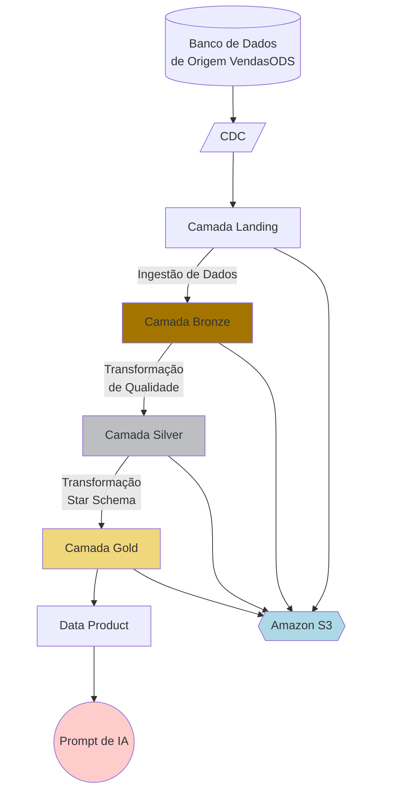

# Exemplo de Engenharia de Dados Qlik

## Objetivo do projeto

O objetivo do projeto é criar um pipeline de dados completo e útil, além de uma camada de analytics no Qlik Cloud: extrair dados de um banco de dados de origem, aterrissar em uma arquitetura medalhão, extrair e transformar os dados em uma estrutura dimensional armazenada em formato parquet, e então carregar tudo em um app de Qlik Analytics.

## Pré-requisitos

1. Banco de dados de origem acessível diretamente ou através de um gateway
   1. Usar gateway requer um para DI e outro para DA
1. Armazenamento em nuvem, ex. Amazon S3
1. Qlik Cloud
   1. Tenant com Agent Features habilitado
   1. API-Key para o usuário
      1. 2 Spaces com acesso completo:
         1. Data Space
         1. Shared Space
      1. 4 conexões
         1. Conexão de Data Integration com o banco de dados de origem
         1. Conexão de Data Integration com o armazenamento de destino
         1. Conexão de Data Analytics com o banco de dados de origem
         1. Conexão de Data Analytics com o armazenamento em nuvem

## Estrutura do projeto

A estrutura do projeto

```
./
├── tenant-information/
│   └── tenant-info.md
|
├── secrets/ --> Ignorado pelo .gitignore
│   └── secrets.env
|
├── data-connections/
│   ├── da-mysql.md
│   ├── da-s3.md
│   ├── di-mysql.md
│   └── di-s3.md
|
├── ModeloDimensional/
│   ├── modelo_dimensional.dot
│   └── modelo_dimensional.png
|
├── source-information/
│   └── VendasODS-ERD.jpg
|
├── scripts/
│   ├── ext001_cadastros.qvs
│   ├── ext002_pedidos_peditem.qvs
│   ├── trf001_silver_vendasods.qvs
│   ├── trf002_silver_vendas.qvs
│   ├── trf003_gold_star_schema.qvs
│   └── viz001_vendasods_analytics.qvs
|
└── README.md
```

## Detalhes dos arquivos do projeto

Estes arquivos contêm as especificações para o desenvolvimento do projeto
- tenant-information/tenant-info.md: Contém as informações para conectar ao tenant do Qlik Cloud
- data-connections/*.md: Contêm as informações para conectar os dados, com base na seção do Qlik e no nome do arquivo de conexão, como 'di-mysql.md' para a conexão de Data Integration com o MySQL.
- secrets/secrets.env: esse arquivo contém as variáveis de ambiente, contendo senhas e chaves de API. Atenção: manter *.env dentro do .gitignore para evitar exposição.

## Diagrama de Fluxo do Pipeline


## Padrões de Desenvolvimento

Os padrões de desenvolvimento, como nomes de tarefas, arquivos e atributos, pastas do repositório e abordagens padrão, devem seguir as regras abaixo:

1. Scripts de Qlik Data Analytics (qvs, qvw, qvf, dfw, etc.):
   1. Nome prefixado pelo objetivo
      1. 'ext' para extração de dados
      1. 'trf' para transformação de dados
      1. 'viz' para visualização de dados
      1. 'gen' para scripts genéricos
   1. Nome sufixado por uma ação numerada, ex. 'ext001', 'ext002', 'trf001', 'trf002'
   1. A descrição deve conter uma explicação completa do propósito e do contexto envolvido
   1. Marcado (tag) com o objetivo, como 'Extract', 'Transform', 'Load', 'Generic' e o objetivo do projeto --> O objetivo deste projeto é 'VendasODS'
1. Projetos de Qlik Data Integration
   1. Nome prefixado pela constante 'PRJ'
   1. Nome sufixado por uma ação numerada, ex. 'prj001', 'prj002'
   1. A descrição deve conter uma explicação completa do propósito e do contexto envolvido
   1. Marcado (tag) com o objetivo do projeto --> O objetivo deste projeto é 'VendasODS'
1. Tarefas de Qlik Data Integration
   1. Nome sufixado pelo objetivo
      1. 'ext' para extração de dados
      1. 'trf' para transformação de dados
      1. 'gen' para tarefas genéricas
   1. Nome sufixado por uma ação numerada, ex. 'ext001', 'ext002', 'trf001', 'trf002'
   1. A descrição deve conter uma explicação completa do propósito e do contexto envolvido
1. Conexões de Dados
   1. O nome das conexões de dados deve ser prefixado pela seção do Qlik, como
      1. 'da' para Data Analytics
      1. 'di' para Data Integration
   1. Sufixado pelo tipo
      1. 'mysql' para banco de dados MySQL
      1. 'oracle' para banco de dados Oracle
      1. 's3' para Amazon S3
      1. 'adls' para Azure Data Lake Storage
      1. 'sqlsrv' para SQL Server
1. Arquitetura Medalhão
   1. Os arquivos da camada Landing devem ser armazenados em uma pasta chamada 'landing'
      1. Landing é organizada por origem, então utilize uma subpasta com o nome da fonte: 'vendasods'. Se uma nova fonte for adicionada, utilize o nome dela como nome da subpasta.
      1. Landing é uma área de armazenamento transitória, podendo ser removida a qualquer momento.
   1. Os arquivos da camada Bronze devem ser armazenados em uma pasta chamada 'bronze'
      1. Bronze é organizada por origem, então utilize uma subpasta com o nome da fonte: 'vendasods'. Se uma nova fonte for adicionada, utilize o nome dela como nome da subpasta.
      1. Bronze é uma área de armazenamento persistente de longo prazo, então todas as tarefas devem adicionar dados a ela de forma incremental.
   1. Os arquivos da camada Silver devem ser armazenados em uma pasta chamada 'silver'
      1. É importante ter subpastas para armazenar mais de um conjunto de arquivos, resultante de múltiplas transformações em sequência; utilize então um sufixo numérico, como silver/silver001, silver/silver002, silver/silver003
      1. Silver é uma área de armazenamento persistente de longo prazo, então todas as tarefas devem adicionar dados a ela de forma incremental.
   1. Camada Gold:
      1. A pasta de arquivos deve se chamar 'gold'
      1. Dimensões prefixadas por 'dim_'
      1. Tabelas fato prefixadas por 'fact_'
      1. Prefixo dos nomes de campos:
         1. Chaves: 'key_'
         1. Flags: 'flg_' exemplos: 'flg_cancel', 'flg_deleted'
         1. Numéricos: 'nm_'
         1. Texto: 'str_'
         1. Outros: 'gen_' para uso genérico
      1. Gold é uma área de armazenamento persistente de longo prazo, então todas as tarefas devem adicionar dados a ela de forma incremental.
