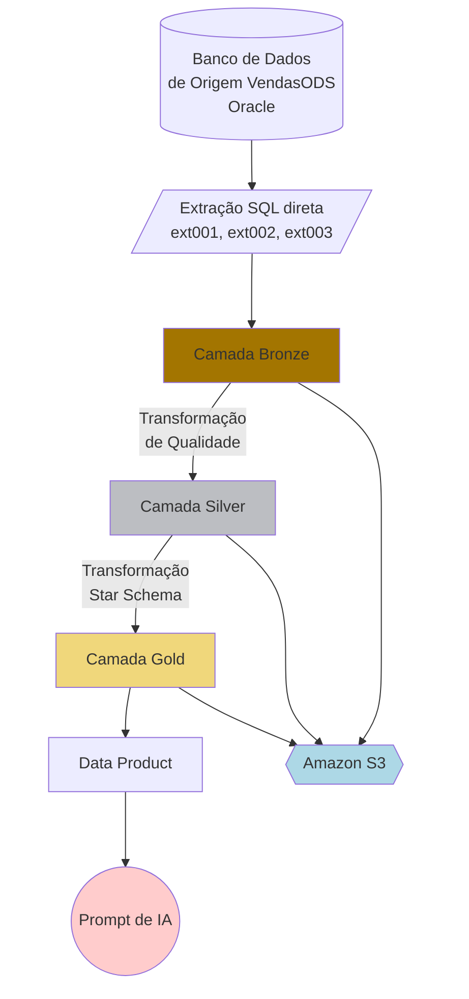
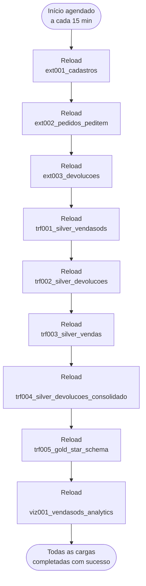

# Exemplo de Engenharia de Dados Qlik — VendasODS (extração via SQL direto)

## Objetivo do projeto

O objetivo do projeto é criar um pipeline de dados completo e útil, além de uma camada de analytics no Qlik Cloud: extrair dados de um banco de dados de origem Oracle (vendas e devoluções) via SQL direto, aterrissar em uma arquitetura medalhão (Bronze → Silver → Gold) armazenada em Parquet no Amazon S3, e carregar tudo em um app de Qlik Analytics — com a cadeia inteira orquestrada por uma Qlik Automation.

Diferente do Projeto Exemplo 2 deste repositório (que usa CDC via Qlik Data Integration), este projeto extrai os dados por SQL direto (`SELECT`, full ou incremental por janela de dias) através da conexão de Data Analytics `da-oracle` — sem Data Movement Gateway, sem projeto de Data Integration.

## Diagrama de Arquitetura

Diagrama de referência geral (camadas, pontos de controle de qualidade/exposição via Qlik Data Product) — **nota**: o Data Movement Gateway/CDC mostrado no diagrama é apenas referência do padrão geral e não é usado neste projeto (ver [Diagrama de Fluxo do Pipeline](#diagrama-de-fluxo-do-pipeline) abaixo para o fluxo real): [projeto/architecture/Medallion Architecture.pdf](<projeto/architecture/Medallion%20Architecture.pdf>) (fonte editável: [.drawio](<projeto/architecture/Medallion%20Architecture.drawio>) / [.pptx](<projeto/architecture/Medallion%20Architecture.pptx>)).


## Diagrama de dados

- Modelo fonte: [projeto/modelos-dados/VendasODS-ERD.jpg](projeto/modelos-dados/VendasODS-ERD.jpg)
- Modelo dimensional:
  - Kimball (referência conceitual): [projeto/modelos-dados/modelo_dimensional_kimball.png](projeto/modelos-dados/modelo_dimensional_kimball.png)
  - Qlik (implementado, com tabela-ponte `link_fato`): [projeto/modelos-dados/modelo_dimensional_qlik.png](projeto/modelos-dados/modelo_dimensional_qlik.png)

## Diagrama de Fluxo do Pipeline



## Diagrama de Atualização (Automação do Pipeline)

A execução em cascata das 9 etapas (extração → Silver → Gold → Analytics) é orquestrada por uma **Qlik Automation** chamada `VendasODS_Pipeline_Execution`, agendada a cada **15 minutos**. Cada etapa só dispara se a anterior tiver `status = SUCCEEDED`; se uma etapa falhar, a cascata é interrompida.



## Estrutura do projeto

> **Segredos/credenciais** (API key do tenant, senha do Oracle, chaves do S3) não ficam dentro deste projeto — são coletados sob demanda e gravados em um único `secrets.env` na **raiz do repositório** (`../secrets.env` a partir daqui, ao lado de `Projeto Exemplo 1/` e `Projeto Exemplo 2/`), coberto pela regra `*.env` do `.gitignore` da raiz. Ver [implantacao/Guia_Instalacao_Projeto.md §0](implantacao/Guia_Instalacao_Projeto.md#0-coletar-credenciais-e-registrar-em-secretsenv).

```
./
├── README.md
├── LICENSE
│
├── implantacao/                       --> O que precisa existir/estar pronto ANTES do pipeline rodar
│   ├── Guia_Implementacao_Novo_Tenant.md  --> Pré-requisitos e ambiente para implantar em um tenant novo
│   ├── Guia_Instalacao_Projeto.md         --> Passo a passo de instalação (comandos, ordem, validação)
│   │
│   ├── tenant-information/
│   │   └── tenant-info.md             --> Informações para conectar ao tenant Qlik Cloud
│   │
│   ├── data-connections/
│   │   ├── da-oracle.md               --> Conexão de Data Analytics com Oracle (usada pelos scripts ext00x)
│   │   ├── da-s3.md                   --> Conexão de storage (camadas Bronze/Silver/Gold)
│   │   ├── di-oracle.md               --> Reservada (não usada pelo pipeline atual, sem CDC)
│   │   └── di-s3.md                   --> Reservada (não usada pelo pipeline atual, sem CDC)
│   │
│   └── base-dados/
│       ├── database_config_vendasods.sql  --> Usuário Oracle 'vendasods' + grants de sessão/DDL (sem CDC/LogMiner)
│       ├── create_database_vendasods.sql  --> Criação das tabelas, FKs, auto increment e constraints
│       └── vendasods_oracle_data.sql      --> Cópia dos dados (INSERT INTO) do schema VENDASODS
│
└── projeto/                           --> O pipeline em si (o que roda em produção)
    ├── architecture/
    │   ├── Medallion Architecture.pdf     --> Diagrama de arquitetura de referência (geral)
    │   ├── Medallion Architecture.drawio
    │   └── Medallion Architecture.pptx
    │
    ├── modelos-dados/
    │   ├── VendasODS-ERD.jpg
    │   ├── modelo_dimensional_kimball.dot / .png  --> Referência conceitual (dimension bus tradicional)
    │   └── modelo_dimensional_qlik.dot / .png     --> Modelo implementado no Qlik (com link_fato)
    │
    ├── automation/
    │   ├── VendasODS_Pipeline_Execution.json                    --> Template da Automation (9 etapas)
    │   └── VendasODS_Pipeline_Execution_Requisitos_Tecnicos.md  --> Requisitos técnicos da Automation
    │
    └── scripts/
        ├── ext001_cadastros.qvs               --> Extract (cadastros, full)
        ├── ext002_pedidos_peditem.qvs         --> Extract (Pedidos/PedItem, incremental por janela de dias)
        ├── ext003_devolucoes.qvs              --> Extract (Devolucoes/Devolucao_Item, incremental por janela de dias)
        ├── trf001_silver_vendasods.qvs        --> Silver (cadastros + Pedidos/PedItem)
        ├── trf002_silver_devolucoes.qvs       --> Silver (Devolucoes/Devolucao_Item)
        ├── trf003_silver_vendas.qvs           --> Silver (Vendas consolidado, por ano)
        ├── trf004_silver_devolucoes_consolidado.qvs --> Silver (Devolucoes consolidado, por ano)
        ├── trf005_gold_star_schema.qvs        --> Gold (star schema Kimball, com fact_devolucoes)
        ├── viz001_vendasods_analytics.qvs     --> App de análise (monta link_fato no load)
        ├── GenerateData.py                    --> GUI (tkinter) gera INSERT/UPDATE/DELETE de teste no Oracle fonte (valida extração incremental)
        └── requirements.txt                   --> Dependências do GenerateData.py (oracledb, PyYAML)
```

## Detalhes dos arquivos do projeto

Estes arquivos contêm as especificações para o desenvolvimento do projeto
- implantacao/tenant-information/tenant-info.md: Contém as informações para conectar ao tenant do Qlik Cloud
- implantacao/data-connections/*.md: Contêm as informações para conectar os dados, com base na seção do Qlik e no nome do arquivo de conexão, como 'da-oracle.md' para a conexão de Data Analytics com o Oracle.
- ../secrets.env (raiz do repositório, fora deste projeto): variáveis de ambiente com senhas e chaves de API, coletadas sob demanda durante o deploy. Atenção: manter *.env dentro do .gitignore da raiz para evitar exposição.

## Documentação

- **[implantacao/Guia_Implementacao_Novo_Tenant.md](implantacao/Guia_Implementacao_Novo_Tenant.md)** — o que precisa existir antes de instalar: licenciamento do tenant, papéis de usuário, conectividade com a fonte, gateway, bucket S3, ambiente de deploy (Git/`qlik-cli`/MCP), checklist de segredos.
- **[implantacao/Guia_Instalacao_Projeto.md](implantacao/Guia_Instalacao_Projeto.md)** — o passo a passo de instalação em si: comandos, ordem de execução, validação, e os padrões de nomenclatura do projeto.

## Padrões de Desenvolvimento

Os padrões de desenvolvimento, como nomes de tarefas, arquivos e atributos, pastas do repositório e abordagens padrão, devem seguir as regras abaixo:

1. Scripts de Qlik Data Analytics (qvs, qvw, qvf, dfw, etc.):
   1. Nome prefixado pelo objetivo
      1. 'ext' para extração de dados
      1. 'trf' para transformação de dados
      1. 'viz' para visualização de dados
      1. 'gen' para scripts genéricos
   1. Nome sufixado por uma ação numerada, ex. 'ext001', 'ext002', 'trf001', 'trf002'
   1. A descrição deve conter uma explicação completa do propósito e do contexto envolvido
   1. Marcado (tag) com o objetivo, como 'Extract', 'Transform', 'Load', 'Generic' e o objetivo do projeto --> O objetivo deste projeto é 'VendasODS'
1. Projetos de Qlik Data Integration
   1. Nome prefixado pela constante 'PRJ'
   1. Nome sufixado por uma ação numerada, ex. 'prj001', 'prj002'
   1. A descrição deve conter uma explicação completa do propósito e do contexto envolvido
   1. Marcado (tag) com o objetivo do projeto --> O objetivo deste projeto é 'VendasODS'
1. Tarefas de Qlik Data Integration
   1. Nome sufixado pelo objetivo
      1. 'ext' para extração de dados
      1. 'trf' para transformação de dados
      1. 'gen' para tarefas genéricas
   1. Nome sufixado por uma ação numerada, ex. 'ext001', 'ext002', 'trf001', 'trf002'
   1. A descrição deve conter uma explicação completa do propósito e do contexto envolvido
1. Conexões de Dados
   1. O nome das conexões de dados deve ser prefixado pela seção do Qlik, como
      1. 'da' para Data Analytics
      1. 'di' para Data Integration
   1. Sufixado pelo tipo
      1. 'mysql' para banco de dados MySQL
      1. 'oracle' para banco de dados Oracle
      1. 's3' para Amazon S3
      1. 'adls' para Azure Data Lake Storage
      1. 'sqlsrv' para SQL Server
1. Arquitetura Medalhão
   1. Os arquivos da camada Landing devem ser armazenados em uma pasta chamada 'landing'
      1. Landing é organizada por origem, então utilize uma subpasta com o nome da fonte: 'vendasods'. Se uma nova fonte for adicionada, utilize o nome dela como nome da subpasta.
      1. Landing é uma área de armazenamento transitória, podendo ser removida a qualquer momento.
   1. Os arquivos da camada Bronze devem ser armazenados em uma pasta chamada 'bronze'
      1. Bronze é organizada por origem, então utilize uma subpasta com o nome da fonte: 'vendasods'. Se uma nova fonte for adicionada, utilize o nome dela como nome da subpasta.
      1. Bronze é uma área de armazenamento persistente de longo prazo, então todas as tarefas devem adicionar dados a ela de forma incremental.
   1. Os arquivos da camada Silver devem ser armazenados em uma pasta chamada 'silver'
      1. É importante ter subpastas para armazenar mais de um conjunto de arquivos, resultante de múltiplas transformações em sequência; utilize então um sufixo numérico, como silver/silver001, silver/silver002, silver/silver003
      1. Silver é uma área de armazenamento persistente de longo prazo, então todas as tarefas devem adicionar dados a ela de forma incremental.
   1. Camada Gold:
      1. A pasta de arquivos deve se chamar 'gold'
      1. Dimensões prefixadas por 'dim_'
      1. Tabelas fato prefixadas por 'fact_'
      1. Prefixo dos nomes de campos:
         1. Chaves: 'key_'
         1. Flags: 'flg_' exemplos: 'flg_cancel', 'flg_deleted'
         1. Numéricos: 'nm_'
         1. Texto: 'str_'
         1. Outros: 'gen_' para uso genérico
      1. Gold é uma área de armazenamento persistente de longo prazo, então todas as tarefas devem adicionar dados a ela de forma incremental.
