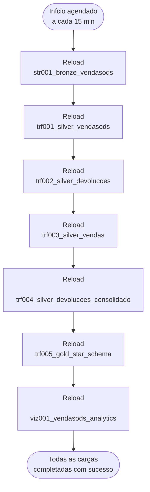

# Exemplo de Engenharia de Dados Qlik — VendasODS

## Objetivo do projeto

O objetivo do projeto é criar um pipeline de dados completo e útil, além de uma camada de analytics no Qlik Cloud: extrair dados de um banco de dados de origem (Oracle) via CDC, aterrissar em uma arquitetura medalhão (Landing → Bronze → Silver → Gold) armazenada em Parquet no Amazon S3, e carregar tudo em um app de Qlik Analytics — com a cadeia inteira orquestrada por uma Qlik Automation.

## Diagrama de Arquitetura

Diagrama de referência completo (camadas, gateway, pontos de controle de qualidade/exposição via Qlik Data Product): [projeto/architecture/Medallion Architecture.pdf](<projeto/architecture/Medallion%20Architecture.pdf>) (fonte editável: [.drawio](<projeto/architecture/Medallion%20Architecture.drawio>) / [.pptx](<projeto/architecture/Medallion%20Architecture.pptx>)).


## Diagrama de dados:

- Modelo fonte: [projeto/modelos-dados/VendasODS-ERD.jpg](projeto/modelos-dados/VendasODS-ERD.jpg)
- Modelo dimensional:
  - Kimball: [projeto/modelos-dados/modelo_dimensional_kimball.png](projeto/modelos-dados/modelo_dimensional_kimball.png)
  - Qlik: [projeto/modelos-dados/modelo_dimensional_qlik.png](projeto/modelos-dados/modelo_dimensional_qlik.png)

## Diagrama de Atualização (Automação do Pipeline)

A execução em cascata das camadas Bronze → Silver → Gold → Analytics é orquestrada por uma **Qlik Automation** chamada `VendasODS_Pipeline_Execution`, agendada a cada **15 minutos**. Cada etapa só dispara se a anterior tiver `status = SUCCEEDED`; se uma etapa falhar, a cascata é interrompida.



## Estrutura do projeto

```
./
├── README.md                          --> Este arquivo
├── LICENSE
│
├── implantacao/                       --> O que precisa existir/estar pronto ANTES do pipeline rodar
│   ├── Guia_Implementacao_Novo_Tenant.md  --> Pré-requisitos e ambiente para implantar em um tenant novo
│   ├── Guia_Instalacao_Projeto.md         --> Passo a passo de instalação (comandos, ordem, validação)
│   │
│   ├── tenant-information/
│   │   └── tenant-info.md             --> Informações para conectar ao tenant Qlik Cloud
│   │
│   ├── secrets/                       --> Deveria estar no .gitignore
│   │   └── secrets.env
│   │
│   ├── data-connections/
│   │   ├── da-oracle.md               --> Conexão de Data Analytics com Oracle (legado/alternativa)
│   │   ├── da-s3.md                   --> Conexão de storage (camadas Bronze/Silver/Gold)
│   │   ├── di-oracle.md               --> Conexão de Data Integration com Oracle (fonte real do CDC)
│   │   └── di-s3.md                   --> Conexão de Data Integration com o destino S3 (landing)
│   │
│   └── base-dados/
│       ├── oracle_instance_cdc_prereqs_vendasods.sql --> Supplemental logging + ARCHIVELOG (sysdba, roda primeiro)
│       ├── cdc_config_vendasods.sql       --> Usuário Oracle 'vendasods' + grants (CDC e DDL)
│       ├── create_database_vendasods.sql  --> Criação das tabelas, FKs, auto increment e constraints
│       └── vendasods_oracle_data.sql      --> Cópia dos dados (INSERT INTO) do schema VENDASODS
│
└── projeto/                           --> O pipeline em si (o que roda em produção)
    ├── architecture/
    │   ├── Medallion Architecture.pdf     --> Diagrama de arquitetura de referência
    │   ├── Medallion Architecture.drawio
    │   └── Medallion Architecture.pptx
    │
    ├── modelos-dados/
    │   ├── VendasODS-ERD.jpg
    │   ├── modelo_dimensional_kimball.dot / .png
    │   └── modelo_dimensional_qlik.dot / .png
    │
    ├── data-integration/
    │   └── P01_VendasODS_S3/          --> Projeto de Data Integration exportado (tarefa CDC 'vendasods-susp')
    │
    ├── automation/
    │   ├── VendasODS_Pipeline_Execution.json                    --> Exportação da Automation que executa a cascata
    │   └── VendasODS_Pipeline_Execution_Requisitos_Tecnicos.md  --> Requisitos técnicos específicos da Automation
    │
    └── scripts/
        ├── ext001_cadastros.qvs               --> Legado (não usado no fluxo atual)
        ├── ext002_pedidos_peditem.qvs         --> Legado (não usado no fluxo atual)
        ├── ext003_devolucoes.qvs              --> Legado (não usado no fluxo atual)
        ├── str001_bronze_vendasods.qvs        --> Bronze (lê da Landing/CDC)
        ├── trf001_silver_vendasods.qvs        --> Silver
        ├── trf002_silver_devolucoes.qvs       --> Silver
        ├── trf003_silver_vendas.qvs           --> Silver
        ├── trf004_silver_devolucoes_consolidado.qvs --> Silver
        ├── trf005_gold_star_schema.qvs        --> Gold (star schema)
        ├── viz001_vendasods_analytics.qvs     --> App de análise
        ├── GenerateData.py                    --> GUI (tkinter) gera INSERT/UPDATE/DELETE de teste no Oracle fonte (valida CDC incremental)
        └── requirements.txt                   --> Dependências do GenerateData.py (oracledb, PyYAML)
```

## Documentação

- **[implantacao/Guia_Implementacao_Novo_Tenant.md](implantacao/Guia_Implementacao_Novo_Tenant.md)** — o que precisa existir antes de instalar: licenciamento do tenant, papéis de usuário, conectividade com a fonte, gateway, bucket S3, ambiente de deploy (Git/`qlik-cli`/MCP), checklist de segredos e riscos conhecidos.
- **[implantacao/Guia_Instalacao_Projeto.md](implantacao/Guia_Instalacao_Projeto.md)** — o passo a passo de instalação em si: comandos, ordem de execução, importação do projeto de Data Integration e da Automation, validação, e os padrões de nomenclatura do projeto.
