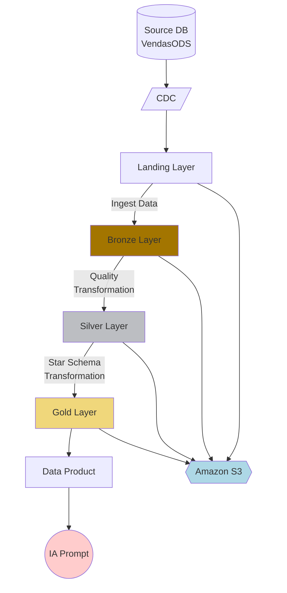

# QLik Data Engineering example

## Project purpose

The project goal is creating a complete and useful data pipeline and data analytics in Qlik Cloud, pulling data from a source database, landing in a medallion architecture, extraction and transforming data into a dimension structure storaging in a parquet format, then loading all into a Qlik Analytics application.

## Pre-requisites

1. Source Database accessible direct or through a gateway
   1. Using gateway requires one for DI and other one for DA
1. Cloud Storage, i.ex. Amazon S3
1. Qlik Cloud
   1. Tenant Agent Features enabled
   1. API-Key for user
      1. 2 Spaces with full access:
         1. Data Space
         1. Shared Space
      1. 4 connections
         1. Data Integration connection to Source database
         1. Data Integration connection to Target storage
         1. Data Analytics connection to Source database
         1. Data Analytics connection to Cloud Storage

## Project structure:

The project structure

```
./Qlik_IA_Example/
├── Tenant Information tenant-information/
│   └── tenant-info.md
|
├── secrets/ --> Ignored by .gitignore
│   └── secrets.md
|
├── Connection Information data-connection/
│   ├── da-mysql.md
│   ├── da-s3.md
│   ├── di-mysql.md
│   └── di-s3.md
|
├── ModeloDimensional/
│   └── modelo_dimensional.md
|
├── Source Tables source-tables/
│   └── VendsaODS-ERD.jpg
|
├── scripts/
│   ├── ext001_cadastros.qvs
│   ├── ext002_pedidos_peditem.qvs
│   ├── trf001_silver_vendasods.qvs
│   ├── trf002_silver_vendas.qvs
│   ├── trf003_gold_star_schema.qvs
│   └── viz001_vendasods_analytics.qvs
|
├── README.md
└── LICENSE
```

## Project files details

These files contains de specification for project development
- tenant/tenant-info.md: Contains information to connect to Qlik Cloud tenant
- data-connections/*.md: Contain information to connect data based on Qlik section and file name connection, like 'di-mysql.md' for data integration connection with MySQL.

## Pipeline Flow Diagram


## Devolopment Standards

To development standards, like tasks, files and attributes names, folder repository and default approaches must follow the below standars:

1. Qlik Data Analytics Scripts (qvs, qvw, qvf, dfw, etc.):
   1. Name prefixed by the goal
      1. 'ext' for data extraction, 
      1. 'trf' for data transformation
      1. 'viz' for data vizualization
      1. 'gen' for generic scripts
   1. Name sufixed by a numbered action, i.e. 'ext001', 'ext002', 'trf001', 'trf002'
   1. Description should be have a complete descript with purpose and context involved
   1. Tagged with the goal, like 'Extract', 'Transform', 'Load', 'Generic' and the project Goal --> This project goal is 'VendasODS'
1. Qlik Data Integration Projects
   1. Name prefixed by 'PRJ' constant
   1. Name sufixed by a numbered action, i.e. 'prj001', 'prj002'
   1. Description should be have a complete descript with purpose and context involved
   1. Tagged with project Goal --> This project goal is 'VendasODS'
1. Qlik Data Integration Tasks
   1. Name sufixed by the goal
      1. 'ext' for data extraction, 
      1. 'trf' for data transformation
      1. 'gen' for generic tasks
   1. Name sufixed by a numbered action, i.e. 'ext001', 'ext002', 'trf001', 'trf002'
   1. Description should be have a complete descript with purpose and context involved
1. Data Connections
   1. Data connections name should be prefixed by Qlik section, like
      1. 'da' for Data Analytics
      1. 'di' for Data Integration
   1. Sufixed by type
      1. 'mysql' for MySQL database
      1. 'oracle' for Oracle database
      1. 's3' for Amazon S3 database
      1. 'adls' for Azure Data Lake Storage
      1. 'sqlsrv' for SQL Server Database
1. Medallion Architecture
   1. Landing layer files muts be stored in a folder named 'landing'
      1. Landing is based on sources, so utilize a subfolder with source name: 'vendasods'. If a new source is added, utilize its name as a subfolder name.
      1. Landing is a transient storage area, then it can be removed any time.
   1. Bronze layer files must be stored in a folder named 'bronze'
      1. Bronze is based on sources, so utilize a subfolder with source name: 'vendasods'. If a new source is added, utilize its name as a subfolder name.
      1. Bronze is a long-time persistent storage area, then all tasks should be incrementally add data into it.
   1. Silver layer files must be stored in a folder named 'silver'
      1. Subfolder is important to store more than one set of files, resulting for multiple transformations in a sequence, then utilize numeric sufix, like silver/silver001, silver/silver002, silver/silver003
      1. Silver is a long-time persistent storage area, then all tasks should be incrementally add data into it.
   1. Golden layer:
      1. Files folder must be named 'gold'
      1. Dimensions prefixed by 'dim_'
      1. Fact tables prefixed by 'fact_'
      1. Field names prefix:
         1. Keys: 'key_'
         1. Flags: 'flg_' examples: 'flg_cancel', 'flg_deleted'
         1. Numeric: 'nm_'
         1. String: 'str_'
         1. Other ones: 'gen_' from generic usage
      1. Gold is a long-time persistent storage area, then all tasks should be incrementally add data into it.
