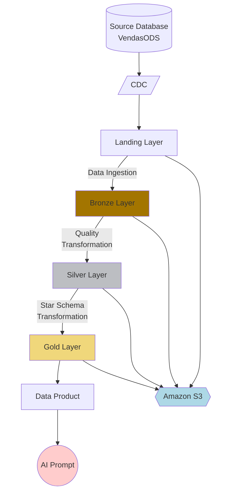
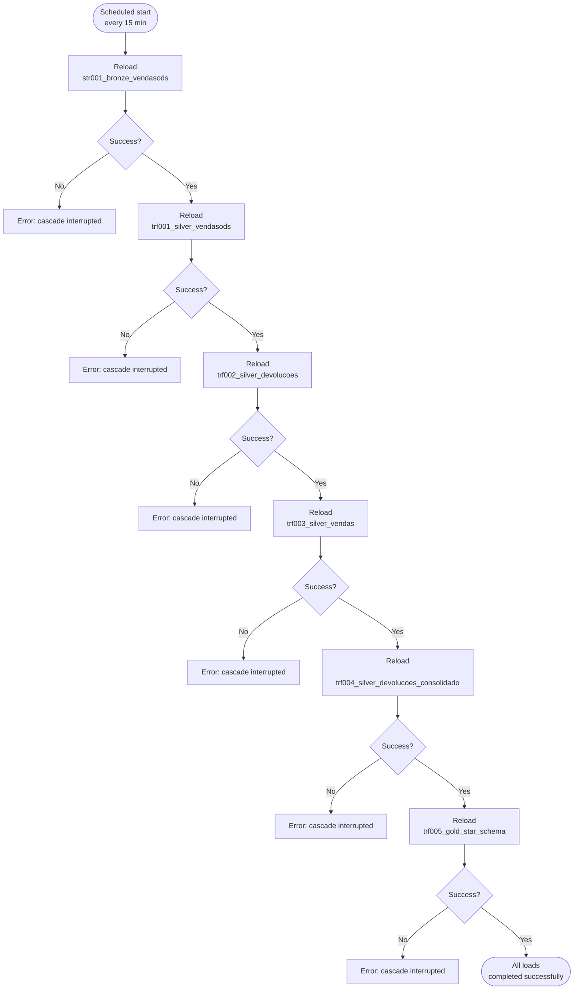

# Qlik Data Engineering Example

## Project Purpose

The project goal is to create a complete and useful data pipeline and data analytics layer in Qlik Cloud, extracting data from a source database, landing it in a medallion architecture, extracting and transforming the data into a dimensional structure stored in parquet format, and then loading everything into a Qlik Analytics application.

## Prerequisites

1. Source database accessible directly or through a gateway
   1. Using gateway requires one for DI and another one for DA
1. Cloud storage, e.g., Amazon S3
1. Qlik Cloud
   1. Tenant Agent features enabled
   1. API-Key for user
   1. 2 Spaces with full access:
      - Data Space
      - Shared Space
   1. 5 connections:
      - Data Integration connection to source database
      - Data Integration connection to target storage
      - Data Analytics connection to source database
      - Data Analytics connection to cloud storage metadata
      - Data Analytics connection to cloud storage

## Project Structure

The project structure

```
./Qlik_IA_Example/
├── Informações do Tenant tenant-information/
│   └── tenant-info.md
|
├── secrets/ --> Ignored by .gitignore
│   └── secrets.md
|
├── Informações de Conexão data-connection/
│   ├── da-oracle.md
│   ├── da-s3.md
│   ├── di-oracle.md
│   └── di-s3.md
|
├── ModeloDimensional/
│   └── modelo_dimensional.md
|
├── Tabelas de Origem source-tables/
│   └── VendsaODS-ERD.jpg
|
├── data-integration/
│   └── P01_VendasODS_S3/ --> Contains Data Integration project
|
├── automation/
│   └── VendasODS_Pipeline_Execution.json --> Qlik Automation export that executes the transformation cascade
|
├── scripts/
│   ├── ext001_cadastros.qvs
│   ├── ext002_pedidos_peditem.qvs
│   ├── ext003_devolucoes.qvs
│   ├── str001_bronze_vendasods.qvs
│   ├── trf001_silver_vendasods.qvs
│   ├── trf002_silver_devolucoes.qvs
│   ├── trf003_silver_vendas.qvs
│   ├── trf004_silver_devolucoes_consolidado.qvs
│   ├── trf005_gold_star_schema.qvs
│   └── viz001_vendasods_analytics.qvs
|
├── README.md
└── LICENSE
```

## Project Files Details

These files contain specifications for project development:

- tenant/tenant-info.md: Contains information to connect to Qlik Cloud tenant
- data-connections/*.md: Contain information to connect data based on Qlik section and file name connection, like 'di-oracle.md' for data integration connection with Oracle.

## Pipeline Flow Diagram



## Pipeline Execution Automation

The cascading execution of Bronze → Silver → Gold layers is orchestrated by a **Qlik Automation** called `VendasODS_Pipeline_Execution`, in the `VendasODS_Shared` space. The exported definition is versioned in `automation/VendasODS_Pipeline_Execution.json`.

### Scheduling

- Interval: **every 15 minutes** (`RRULE:FREQ=MINUTELY;INTERVAL=15`)
- Time zone: `America/Sao_Paulo`
- Execution mode: `scheduled`

### Cascade Logic
The automation executes reloads in the pipeline dependency order, one `Qlik Cloud Services - Do Reload` block (with "Wait for reload to complete") per app, each followed by a condition block that checks `status = SUCCEEDED`. If any step fails, the cascade is interrupted (error block with `stop` action) and subsequent steps are not executed — avoiding processing Silver/Gold over an incomplete Bronze.



## Development Standards

Development standards, such as task names, files and attributes, folder repository and default approaches must follow the standards below:

1. Qlik Data Analytics Scripts (qvs, qvw, qvf, dfw, etc.):
   1. Name prefixed by goal
      1. 'ext' for data extraction,
      1. 'trf' for data transformation
      1. 'viz' for data visualization
      1. 'gen' for generic scripts
      1. 'str' for storage scripts
   1. Name suffixed by a numbered action, e.g. 'ext001', 'ext002', 'trf001', 'trf002'
   1. Description should have a complete explanation with purpose and context involved
   1. Tagged with goal, like 'Extract', 'Transform', 'Load', 'Generic' and project Goal --> This project goal is 'VendasODS'
1. Qlik Data Integration Projects
   1. Name prefixed by 'PRJ' constant
   1. Name suffixed by a numbered action, e.g. 'prj001', 'prj002'
   1. Description should have a complete explanation with purpose and context involved
   1. Tagged with project Goal --> This project goal is 'VendasODS'
1. Qlik Data Integration Tasks
   1. Name suffixed by goal
      1. 'ext' for data extraction,
      1. 'trf' for data transformation
      1. 'gen' for generic tasks
   1. Name suffixed by a numbered action, e.g. 'ext001', 'ext002', 'trf001', 'trf002'
   1. Description should have a complete explanation with purpose and context involved
1. Data Connections
   1. Data connections name should be prefixed by Qlik section, like
      1. 'da' for Data Analytics
      1. 'di' for Data Integration
   1. Suffixed by type
      1. 'mysql' for MySQL database
      1. 'oracle' for Oracle database
      1. 's3' for Amazon S3 database
      1. 'adls' for Azure Data Lake Storage
      1. 'sqlsrv' for SQL Server Database
1. Medallion Architecture
   1. Landing layer files must be stored in a folder named 'landing'
      1. Landing is based on sources, so utilize a subfolder with source name: 'vendasods'. If a new source is added, utilize its name as a subfolder name.
      1. Landing is a transient storage area, then it can be removed any time.
   1. Bronze layer files must be stored in a folder named 'bronze'
      1. Bronze is based on sources, so utilize a subfolder with source name: 'vendasods'. If a new source is added, utilize its name as a subfolder name.
      1. Bronze is a long-time persistent storage area, then all tasks should incrementally add data into it.
   1. Silver layer files must be stored in a folder named 'silver'
      1. Subfolder is important to store more than one set of files, resulting from multiple transformations in sequence, then utilize numeric suffix, like silver/silver001, silver/silver002, silver/silver003
      1. Silver is a long-time persistent storage area, then all tasks should incrementally add data into it.
   1. Gold layer:
      1. Files folder must be named 'gold'
      1. Dimensions prefixed by 'dim_'
      1. Fact tables prefixed by 'fact_'
      1. Field names prefix:
         1. Keys: 'key_'
         1. Flags: 'flg_' examples: 'flg_cancel', 'flg_deleted'
         1. Numeric: 'nm_'
         1. String: 'str_'
         1. Other ones: 'gen_' from generic usage
      1. Gold is a long-time persistent storage area, then all tasks should incrementally add data into it.
